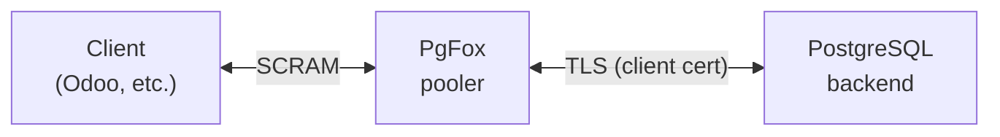

#  PgFox

PgFox is a transparent PostgreSQL connection pooler written in Go. It sits
between your application and PostgreSQL and lets many client connections share a
small number of backend connections, without the application noticing a proxy is
present.

Unlike pooler configurations that force you to give up features in exchange for
efficiency, PgFox keeps full PostgreSQL semantics — transactions, prepared
statements, LISTEN/NOTIFY, and query cancellation all work — while still
multiplexing clients onto a small backend pool.



## What makes it transparent

- **Client authentication is real.** PgFox speaks SCRAM-SHA-256 to the client
  and verifies the password against the role's stored verifier in PostgreSQL —
  it is not a pass-the-password shim and stores no credentials in its config.
- **Backend authentication uses certificates.** PgFox connects to PostgreSQL
  with a per-user TLS client certificate it generates and signs itself, so no
  database passwords live in the pooler.
- **Prepared statements are shared safely.** PgFox rewrites prepared statements
  to internal, content-addressed names and deploys each one to a backend only
  once, so clients reusing the same query share the same parsed statement across
  pooled connections.
- **Query cancellation works end to end.** Each client gets its own cancel key;
  a cancel request is routed to whichever backend is currently running that
  client's query.

## Quick start

**Prerequisites:** Docker; PostgreSQL **14+** (for `pg_read_all_auth_data`, used
by the privileged role — on PG 13 and earlier that role must be a superuser);
`openssl` if you bring your own CA; and every client role must already exist in
PostgreSQL with a SCRAM password.

```bash
# Build
go build -o pgfox ./...

# Run with a config file
./pgfox --config config.yaml
```

> On its first run PgFox generates its certificates, but it **cannot serve
> clients until PostgreSQL is configured to trust them**. Follow
> [Deployment](docs/deployment.md) end to end first — it covers the shared CA
> and the PostgreSQL `ssl`/`pg_hba.conf` setup. The steps below assume that is
> done.

Point a client at PgFox's listen address (`:5433` in the sample config; the
Docker examples use `:5432`):

```bash
psql "host=localhost port=5433 dbname=mydb user=myrole sslmode=disable"
```

PgFox authenticates the client with SCRAM, opens (or reuses) a backend
connection to the target PostgreSQL using a certificate for `myrole`, and routes
queries through the pool. (`sslmode=disable` is the client↔PgFox hop; PgFox↔
PostgreSQL is always TLS. PgFox also accepts TLS client connections — see
[Usage scenarios](docs/usage.md#connecting-over-tls).)

## Documentation

New here? Start with **[Deployment](docs/deployment.md)** to get PgFox and
PostgreSQL running together, then **[Usage scenarios](docs/usage.md)** for what
clients can do.

- [Deployment](docs/deployment.md) — running PgFox and PostgreSQL together with
  Docker, including the shared certificate authority and the PostgreSQL-side
  TLS/auth configuration. **Read this first.**
- [Usage scenarios](docs/usage.md) — what happens for regular queries,
  transactions, prepared statements (asyncpg / psycopg2), LISTEN/NOTIFY, and
  cancellation.
- [Configuration](docs/configuration.md) — every config field, with examples
  drawn from the sample `config.yaml`.
- [Architecture](docs/architecture.md) — how pooling, prepared-statement
  multiplexing, transactions, LISTEN/NOTIFY, and cancellation actually work.
- [Startup & wire protocol](docs/protocol.md) — the connection, authentication,
  and cancellation flows at the protocol level.
- [Playbook](docs/playbook.md) — the wire-level protocol spec, scenario by
  scenario.

## License

AGPL v3 — see the LICENSE file.
