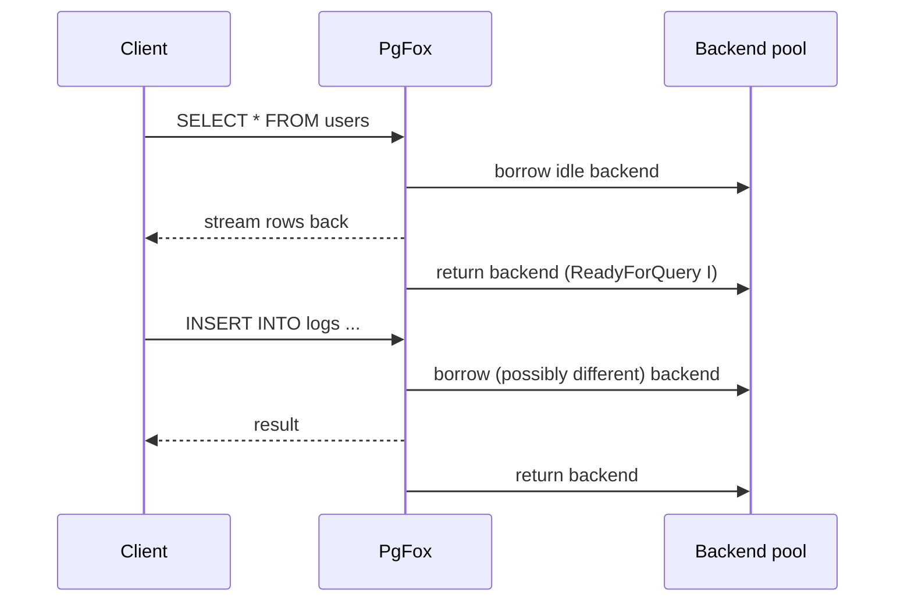
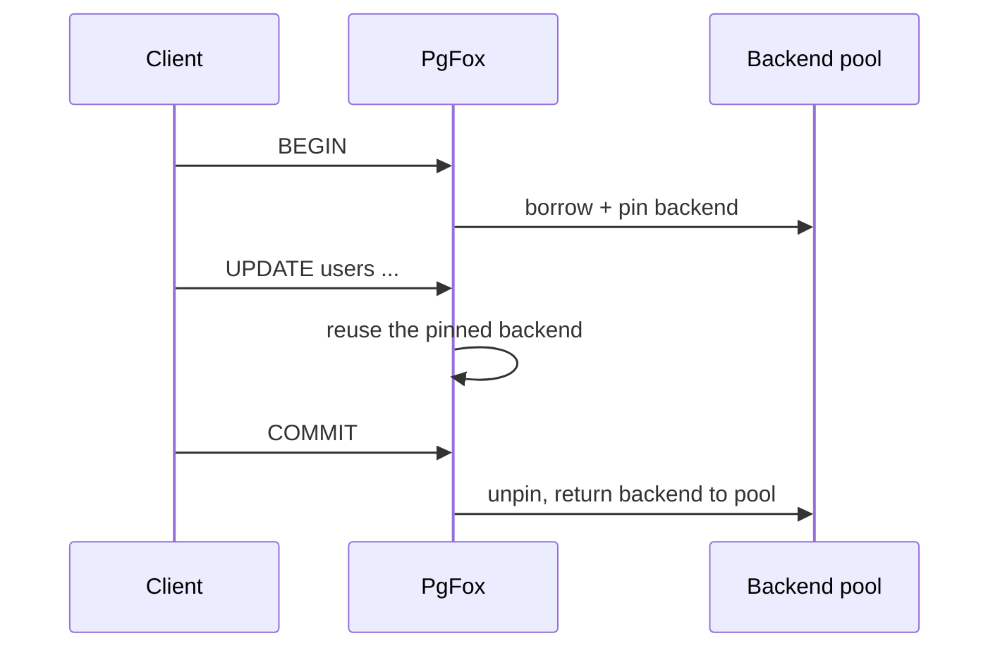
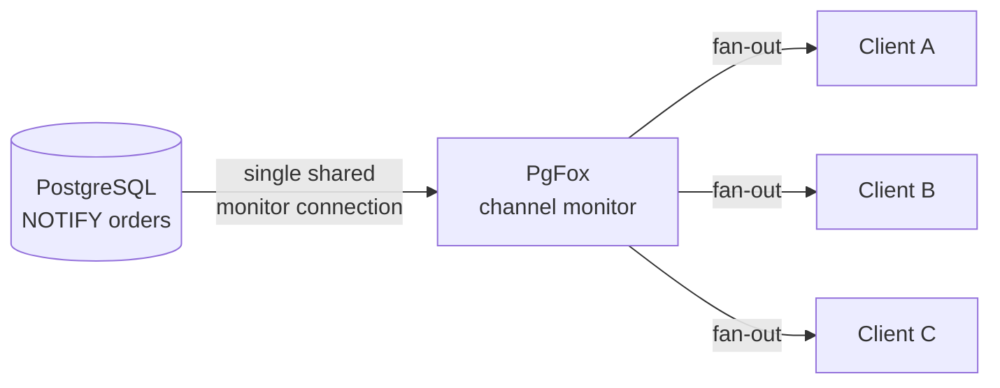

# Architecture

PgFox is a transparent proxy: a client connects to PgFox exactly as it would to
PostgreSQL, and PgFox forwards the PostgreSQL wire protocol to a backend server,
multiplexing many clients onto a small pool of backend connections.

This document describes how that multiplexing works while preserving full
PostgreSQL semantics.

## Components

- **Client connections.** Each accepted client gets a goroutine that reads its
  protocol messages and drives the work below.
- **Targets.** A target is a configured PostgreSQL server (host/port plus rules
  and connection parameters). PgFox can have several targets.
- **Pools.** For each `(database, user)` pair on a target, PgFox maintains a
  pool of backend connections. A pool hands out idle connections and tracks the
  ones currently in use.
- **Privileged connection.** Per target, PgFox keeps one privileged connection
  (authenticated as `pgfox_role`) used to read role password verifiers from
  `pg_authid` so it can authenticate clients. Clients are not accepted until
  this connection is established.

## Authentication model

PgFox authenticates in both directions, and does so without storing any
database passwords in its configuration.

**Client → PgFox: SCRAM-SHA-256.** PgFox acts as a SCRAM server. When a client
connects, PgFox fetches the role's stored SCRAM verifier from `pg_authid` (via
the privileged connection) and runs the SCRAM exchange against it. The client
proves it knows the password without PgFox ever holding a plaintext credential.

**PgFox → PostgreSQL: TLS client certificates.** PgFox connects to the backend
using a per-user certificate (`{username}.crt` / `.key`) signed by PgFox's own
certificate authority. PostgreSQL is expected to map the certificate's identity
to the role. PgFox generates the CA and all required certificates automatically
on first use, and auto-renews user certificates when they expire.

The result is end-to-end identity: the client authenticates as its real role,
and the backend session runs as that same role — but no passwords are kept in
PgFox.

## Connection pooling: a single hybrid model

PgFox has one pooling behavior; there are no session/transaction/statement
modes to choose between. The behavior adapts automatically to what each client
is doing.

### Regular (autocommit) queries

The common case. A client sends a query, PgFox borrows an idle backend from the
pool, forwards the query, streams the response back, and returns the backend to
the pool as soon as the backend reports it is idle again (a `ReadyForQuery` with
status `I`). The client is never tied to a specific backend, so a handful of
backends can serve many clients.

### Transactions

When a client opens a transaction, PgFox pins the backend to that client for the
duration. PostgreSQL reports transaction state on every `ReadyForQuery`
(`T` = in a transaction block, `E` = in a failed transaction block, `I` = idle).
While the status is `T` or `E`, the same backend stays assigned to the client;
when it returns to `I` (after `COMMIT` or `ROLLBACK`), the backend is unpinned
and returned to the pool.

Pinning is keyed off the actual transaction status, so it is exactly as
fine-grained as PostgreSQL's own notion of "in a transaction."

### Prepared-statement multiplexing

This is the core of how PgFox stays efficient without breaking prepared
statements.

When a query can be parameterized, PgFox extracts its literal values, rewrites
the query into a canonical form with `$1..$N` placeholders, hashes that
canonical SQL, and uses an internal statement name of the form `pfx_<hash>`.
Because the name is derived from the query's content, any client issuing the
same logical query maps to the same internal statement.

Each backend tracks which `pfx_` statements it has already parsed. The first
time a given statement is needed on a given backend, PgFox sends a `Parse`; every
subsequent use on that backend skips straight to `Bind`/`Execute`. So a prepared
statement is parsed once per backend, then shared by every client that uses it —
even though those clients are not pinned to that backend.

Statements fall into three categories:

- **Remappable named statements** (for example asyncpg's `__asyncpg_stmt_*`) and
  **simple queries containing literals** are rewritten to `pfx_` names and shared
  through the per-target cache as described above.
- **Unnamed statements** pass through for the duration of their pipeline.
- **Non-remappable named statements** keep their original name and pin the
  backend to the client (their state lives on that specific connection and
  cannot be safely shared).

### LISTEN/NOTIFY

PgFox does **not** give each listening client its own backend connection.
Instead, for each channel it maintains a single shared monitor connection to the
backend and fans incoming notifications out to every subscribed client over that
client's own socket.

- **LISTEN** registers the client as a subscriber to the channel's monitor
  (creating the monitor on first subscription).
- **UNLISTEN** removes the subscription; when the last subscriber leaves, the
  monitor connection is torn down.
- **NOTIFY** outside a transaction is executed on a borrowed backend and returned
  immediately. Inside a transaction it runs on the client's pinned backend, so it
  fires at `COMMIT` and is discarded on `ROLLBACK`, exactly as PostgreSQL
  specifies.
- **LISTEN / UNLISTEN inside a transaction** are deferred until the transaction
  commits, discarded on rollback, and rejected while the transaction is in a
  failed state — matching PostgreSQL's transactional behavior for these commands.

This keeps notification delivery correct and real-time while using one backend
connection per active channel rather than one per listening client.

### Query cancellation

Query cancellation in PostgreSQL happens out of band: the client opens a brand
new connection and sends a `CancelRequest` carrying the `(process id, secret)`
it was given at login. A pooler cannot simply forward those values, because the
client is not bound to a single backend.

PgFox handles this with its own indirection:

1. At login PgFox assigns each client a unique `(pid, secret)` that it generates,
   and sends that as the client's `BackendKeyData`.
2. While a client is waiting on a backend response, PgFox records which backend
   is currently serving it.
3. When a `CancelRequest` arrives, PgFox looks up the client by its `pid`,
   verifies the `secret`, finds the backend currently running that client's
   query, and forwards a real `CancelRequest` to PostgreSQL using **that
   backend's** real key.

As with any pooled cancellation, there is a small inherent race: if the query
finishes and the backend is reused in the instant before the cancel is
forwarded, the cancel may target a different query or be ignored — PostgreSQL
treats a stray cancel as a harmless no-op.

## Connection lifecycle and health

- **Idle reaping.** Connections that sit idle in a pool beyond the configured
  idle timeout are closed.
- **Lazy failure detection.** A connection that died while idle is detected on
  next use (a read/write error), at which point it is removed rather than
  returned. PgFox does not run a probe on the hot return path.
- **Disconnect cleanup.** If a client disconnects while holding a pinned backend
  (an open transaction, or client-specific prepared statements), that backend is
  terminated rather than returned to the pool, since its state is no longer safe
  to reuse.

## Why this design

A traditional session pooler ties one client to one connection and scales
poorly. A traditional transaction pooler scales well but typically drops
LISTEN/NOTIFY and other session features. PgFox borrows per query by default,
pins only when correctness requires it (transactions, client-specific
statements), and shares prepared statements and listen monitors across clients —
so many clients run on few backends **and** the full feature set keeps working.
