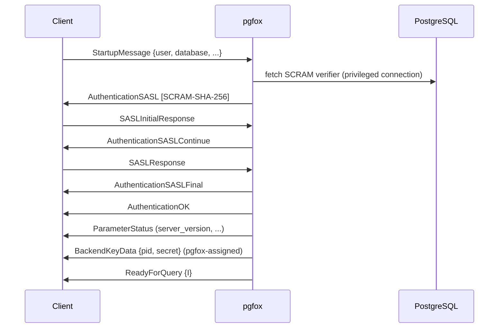
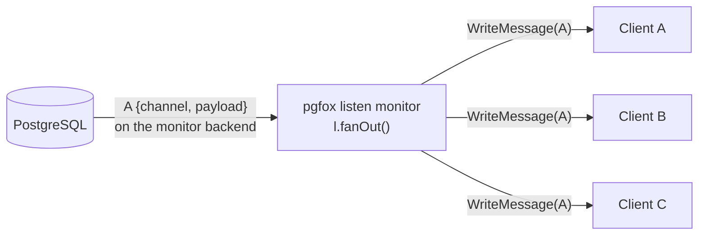

# pgfox Protocol Playbook

This document describes exactly what pgfox does at the PostgreSQL wire protocol
level for every client scenario. Each section defines the expected message
sequence, pgfox's internal decisions, and the invariants that must hold. It is
intended both as reference documentation and as the specification against which
integration tests are written.

---

## Conventions

```
C→P   client to pgfox
P→B   pgfox to backend
B→P   backend to pgfox
P→C   pgfox to client
```

Message codes follow the PostgreSQL wire protocol:

| Code | Name                  | Direction      |
|------|-----------------------|----------------|
| `Q`  | Query (simple)        | C→P            |
| `P`  | Parse                 | C→P or P→B     |
| `B`  | Bind                  | C→P or P→B     |
| `D`  | Describe              | C→P or P→B     |
| `E`  | Execute               | C→P or P→B     |
| `C`  | Close                 | C→P or P→B     |
| `S`  | Sync                  | C→P or P→B     |
| `H`  | Flush                 | C→P or P→B     |
| `X`  | Terminate             | C→P or P→B     |
| `1`  | ParseComplete         | B→P or P→C     |
| `2`  | BindComplete          | B→P or P→C     |
| `3`  | CloseComplete         | B→P or P→C     |
| `n`  | NoData                | B→P or P→C     |
| `t`  | ParameterDescription  | B→P or P→C     |
| `T`  | RowDescription        | B→P or P→C     |
| `D`  | DataRow               | B→P or P→C     |
| `C`  | CommandComplete       | B→P or P→C     |
| `Z`  | ReadyForQuery         | B→P or P→C     |
| `E`  | ErrorResponse         | B→P or P→C     |
| `A`  | NotificationResponse  | B→P or P→C     |
| `N`  | NoticeResponse        | B→P or P→C     |
| `S`  | ParameterStatus       | B→P or P→C     |
| `K`  | BackendKeyData        | B→P or P→C     |

---

## 1. Connection Startup

### 1.1 Plain TCP connection



Detailed message trace:

```
C→P  StartupMessage { protocol=196608, params={user, database, ...} }
P→C  AuthenticationSASL { mechanisms=["SCRAM-SHA-256"] }
C→P  SASLInitialResponse { mechanism, client-first-message }
P→C  AuthenticationSASLContinue { server-first-message }
C→P  SASLResponse { client-final-message }
P→C  AuthenticationSASLFinal { server-final-message }
P→C  AuthenticationOK
P→C  ParameterStatus* (server_version, client_encoding, …)
P→C  BackendKeyData { pid=<pgfox-assigned>, secret=<random> }
P→C  ReadyForQuery { status='I' }
```

**pgfox decisions:**

- SCRAM-SHA-256 is performed entirely within pgfox using a stored verifier fetched
  via the privileged connection (`fetchSCRAMVerifier`). The client never has a
  direct connection to PostgreSQL during auth.
- `BackendKeyData` sends a unique, pgfox-assigned `(pid, secret)` per client --
  not a real backend pid, and not dummy zeros. pgfox registers the pair so an
  out-of-band CancelRequest can be mapped back to this client and forwarded to
  whichever backend is running its query (see section 1.4).
- ParameterStatus messages are forwarded from `target.params` (populated from the
  privileged backend's startup sequence).

### 1.2 TLS upgrade (SSLRequest)

```
C→P  SSLRequest (8-byte special message)
P→C  'S'  (single byte — TLS accepted)
     [TLS handshake]
     [continue with startup as above]
```

**Invariant:** TLS to pgfox is optional. If a client-facing certificate is
available pgfox replies `S` and upgrades (the cert is `{pgfox_dir}/pgfox.crt`,
CN/SAN = `server.hostname`); otherwise it replies `N` and the client continues
in plaintext. Either way SCRAM still runs -- TLS protects the transport, it does
not replace authentication.

### 1.3 Reconnect after pgfox restart

When pgfox restarts, all client TCP connections are dropped. Clients (e.g. Odoo,
asyncpg) must reconnect from scratch — there is no session state to restore.

Active listen monitors are torn down on shutdown (`shutdownListeners`). After
restart, clients that had LISTEN subscriptions must re-issue `LISTEN` to
re-establish monitoring. **This is a known limitation**: clients that detect
the disconnect and reconnect automatically will restore notifications; clients
that do not (e.g. Odoo's chat bus until it restarts) will not receive
notifications until their process reconnects.

**Test scenario:** restart pgfox with an active Listener client; verify the
client receives a connection error and that after reconnect the listen monitor
is re-established correctly.

---

### 1.4 Out-of-band query cancellation

A client cancels a running query by opening a **separate** TCP connection and
sending a CancelRequest carrying the `(pid, secret)` it received in
`BackendKeyData`.

```mermaid
sequenceDiagram
    participant C as Client (new conn)
    participant P as pgfox
    participant PG as PostgreSQL
    C->>P: CancelRequest {pid, secret}
    Note over P: pid maps to a client in cancelKeys;<br/>verify secret; take client.activeBackend()
    P->>PG: CancelRequest {backend.pid, backend.secret}
    Note over PG: cancels the server process<br/>(no-op if the query already finished)
```

Detailed message trace:

```
C→P  CancelRequest { code=80877102, pid=<client pid>, secret=<client secret> }
     (brand-new connection -- no StartupMessage, no auth)

P internal:
  client = cancelKeys.lookup(pid)        (registered at login, 1.1)
  if client == nil or client.secret != secret: ignore
  backend = client.activeBackend()       (the backend running the in-flight query)
  if backend == nil: ignore

P→B' (new short-lived connection to the backend's target)
P→B' CancelRequest { code=80877102, pid=backend.pid, secret=backend.secret }
     (the BACKEND's real key, captured from its BackendKeyData at connect)
     close
```

**pgfox decisions:**

- The client's `(pid, secret)` identify the *client*, not a backend. pgfox keeps
  a `pid -> client` registry (`cancelKeys`), populated at login and removed on
  disconnect.
- `activeBackend` is set while the client is awaiting a backend response and
  cleared afterward, so a cancel targets the backend actually running the query
  -- including autocommit queries, not only pinned transactions.
- pgfox forwards the cancel using the backend's real `(pid, secret)`, so
  PostgreSQL cancels the correct server process.

**Invariant / known race:** cancellation is asynchronous. If the query finishes
and the backend is returned or reused in the instant before the cancel is
forwarded, the cancel may hit a different query or none; PostgreSQL treats a
cancel for a no-longer-running query as a harmless no-op.

**Test scenario:** run `SELECT pg_sleep(30)` and issue a cancel (psql Ctrl-C);
verify the backend query is cancelled and the client receives
`ERROR: canceling statement due to user request`.

---

## 2. Simple Query Protocol

Triggered by message type `Q`. Each query is a complete round-trip.

### 2.1 Plain passthrough query (DDL, multi-statement, SET, etc.)

```
C→P  Q { "CREATE TABLE foo (...)\0" }
P→B  (borrow backend from Pool)
P→B  Q { "CREATE TABLE foo (...)\0" }
B→P  CommandComplete { "CREATE TABLE" }
B→P  ReadyForQuery { 'I' }
P→C  CommandComplete { "CREATE TABLE" }
P→C  ReadyForQuery { 'I' }
P→B  (return backend to Pool via returnConn)
```

**pgfox decisions:**

- `ClassifyAndParameterize` returns `(SimpleQueryOther, nil)` for DDL and
  non-parameterizable queries.
- A backend is borrowed, query forwarded verbatim, response forwarded verbatim.
- `reconcileConn` returns backend to Pool if `txStatus='I'`.

### 2.2 Parameterizable DML via stmt cache (happy path)

For queries like `SELECT id FROM users WHERE email = 'foo@bar.com'` where pgfox
can extract literals:

```
C→P  Q { "SELECT id FROM users WHERE email = 'foo@bar.com'\0" }

P internal:
  ClassifyAndParameterize → { hash="a1b2c3d4", canonical="SELECT id FROM users WHERE email = $1",
                              values=["foo@bar.com"] }
  stmtCache.GetOrRegister(hash, canonical, original, paramCount=1)

P→B  (borrow backend B1)

if !B1.HasStmt(hash):
  P→B  P { name="pfx_a1b2c3d4", query="SELECT id FROM users WHERE email = $1", paramOIDs=[] }

P→B  B { portal="", stmt="pfx_a1b2c3d4", paramFmts=[], params=["foo@bar.com"], resultFmts=[] }
P→B  D { 'P', portal="" }      (portal Describe — makes the backend emit RowDescription)
P→B  E { portal="", maxRows=0 }
P→B  S

B→P  ParseComplete  (only if Parse was sent)
B→P  BindComplete
B→P  RowDescription { ... }    (from the Describe; NoData instead if no rows returned)
B→P  DataRow { ... }
B→P  CommandComplete { "SELECT 1" }
B→P  ReadyForQuery { 'I' }

P→C  RowDescription { ... }    (text format — exactly what a 'Q' against postgres yields)
P→C  DataRow { ... }
P→C  CommandComplete { "SELECT 1" }
P→C  ReadyForQuery { 'I' }

P internal:
  B1.MarkStmt(hash)           (if Parse was sent)
  returnConn(B1)              (txStatus='I', no transaction)
```

**pgfox decisions:**

- `ParseComplete`, `BindComplete`, and `NoData` are consumed by pgfox and not
  forwarded to the client (none exist in the simple query protocol). `NoData`
  appears when the Describe targets a portal whose statement returns no rows
  (e.g. `INSERT` without `RETURNING`); the matching `CommandComplete` is still
  forwarded.
- **Result format invariant:** pgfox always requests from the backend the result
  format the client will consume, then forwards the bytes verbatim. A
  simple-query client issued `Q` and can only read text, so `resultFmts=[]`
  (empty = all text). pgfox never transcodes and holds no value-level type
  knowledge. The extended-protocol path (§3) upholds the same invariant by
  forwarding the client's own Bind unchanged, so a binary client there receives
  binary — the format is always the client's choice, never pgfox's.
- A portal `Describe` is required: `Execute` never emits a `RowDescription`, but a
  simple-query client must receive one before any `DataRow`. The Describe makes
  the backend produce it (or `NoData`), which pgfox forwards / swallows.
- If the backend already has the statement (`HasStmt`), Parse is skipped entirely.
- `returnConn` is called directly from the client goroutine, bypassing the target
  goroutine event loop.

### 2.3 Parameterizable DML — already-parameterized query

For queries like `SELECT $1::int` sent via simple query protocol:

```
C→P  Q { "SELECT $1::int\0" }
```

`containsParam=true` → `ClassifyAndParameterize` still returns a `ParameterizeResult`
with `CanonicalSQL="SELECT $1::int"`, `Values=nil`, `Hash=<hash>`. The statement
is registered in the cache. However, the simple query protocol cannot bind
parameters, so this path is a passthrough — `result.Values` is nil and a
`ParameterizeResult` without values cannot be executed via Bind. The query is
forwarded verbatim.

**Note:** In practice this scenario does not arise — clients using simple query
protocol with `$1` parameters are unusual. The path exists for completeness.

### 2.4 Transaction block

```
C→P  Q { "BEGIN\0" }
P→B  (borrow backend B1)
P→B  Q { "BEGIN\0" }
B→P  CommandComplete { "BEGIN" }
B→P  ReadyForQuery { 'T' }
P→C  CommandComplete { "BEGIN" }
P→C  ReadyForQuery { 'T' }
P internal: reconcileConn(txStatus='T') → pin B1 to client

C→P  Q { "SELECT ...\0" }
P→B  (use pinned B1)
B→P  ...
P→C  ...

C→P  Q { "COMMIT\0" }
P→B  (use pinned B1)
P→B  Q { "COMMIT\0" }
B→P  CommandComplete { "COMMIT" }
B→P  ReadyForQuery { 'I' }
P→C  CommandComplete { "COMMIT" }
P→C  ReadyForQuery { 'I' }
P internal: reconcileConn(txStatus='I', wasPinned=true) → unpin, returnConn(B1)
```

**Invariant:** Once a backend is pinned (txStatus ∈ {'T','E'}), every subsequent
query from this client uses the same backend until txStatus returns to 'I'.
`SetInTransaction(true)` is set on the client; `IsInTransaction()` gates
`borrowConn` to use the pinned connection.

---

## 3. Extended Query Protocol

Triggered when the first message is not `Q` or `X`. pgfox buffers the full
pipeline up to the first `S` (Sync) or `H` (Flush) before processing.

### 3.1 Named statement — remappable (asyncpg with statement cache)

asyncpg's first call to `fetchval("SELECT $1::int", 42)`:

**Pipeline 1** (prepare + describe, ends with Flush):
```
C→P  P { name="_asyncpg_abc", query="SELECT $1::int", paramOIDs=[] }
C→P  D { type='S', name="_asyncpg_abc" }
C→P  H

P internal phase 1:
  ClassifyAndParameterize("SELECT $1::int") → (SimpleQueryOther, {hash="xxxx", ...})
  stmtCache.GetOrRegister("xxxx", ...)
  MapStmtName("_asyncpg_abc", "xxxx")
  rewrite P → P { name="pfx_xxxx", ... }
  rewrite D → D { type='S', name="pfx_xxxx" }
  remappedParses[0] = "xxxx"

P→B  (borrow backend B1)

Phase 4:
  B1.HasStmt("xxxx") = false → send Parse
  sentParseHashes = ["xxxx"]

P→B  P { name="pfx_xxxx", query="SELECT $1::int" }
P→B  D { type='S', name="pfx_xxxx" }
P→B  H

B→P  ParseComplete
B→P  ParameterDescription { numParams=1, OIDs=[23] }
B→P  RowDescription { ... }

Phase 5 (drainFlushResponse):
  ParseComplete → B1.MarkStmt("xxxx") ; forward to client
  ParameterDescription → forward
  RowDescription → forward, done=true

P→C  ParseComplete
P→C  ParameterDescription
P→C  RowDescription
(no ReadyForQuery — Flush does not produce one)

B1 stays associated with client (not yet returned to Pool)
```

**Pipeline 2** (execute, ends with Sync):
```
C→P  B { portal="", stmt="_asyncpg_abc", paramFmts=[1], params=[binary(42)], resultFmts=[0] }
C→P  E { portal="", maxRows=0 }
C→P  S

P internal phase 1:
  Bind: LookupInternalName("_asyncpg_abc") → "xxxx"
  rewrite B → B { portal="", stmt="pfx_xxxx", ... }
  bindRequiredHashes["xxxx"] = true

Phase 3.5:
  hash="xxxx", B1.HasStmt("xxxx") = true → skip inject

Phase 4:
  forward B { stmt="pfx_xxxx", ... }
  forward E
  forward S

B→P  BindComplete
B→P  DataRow { ... }
B→P  CommandComplete { "SELECT 1" }
B→P  ReadyForQuery { 'I' }

P→C  BindComplete
P→C  DataRow { ... }
P→C  CommandComplete { "SELECT 1" }
P→C  ReadyForQuery { 'I' }

reconcileConn(txStatus='I', wasPinned=false, requiresPin=false) → returnConn(B1)
```

**Subsequent calls** (asyncpg reuses cached statement, sends only Bind+Execute+Sync):
```
C→P  B { portal="", stmt="_asyncpg_abc", ... }
C→P  E
C→P  S

Phase 1: no Parse → remappedParses={}, bindRequiredHashes["xxxx"]=true
Phase 2: borrowConn → may get backend B2 (different from B1)

Phase 3.5:
  hash="xxxx", B2.HasStmt("xxxx") = false → inject:
    P→B  P { name="pfx_xxxx", query="SELECT $1::int" }
    P→B  S
    B→P  ParseComplete → B2.MarkStmt("xxxx")
    B→P  ReadyForQuery

Phase 4: forward B + E + S (name rewritten to pfx_xxxx)
Phase 5: forward responses, returnConn(B2)
```

### 3.2 Named statement — non-remappable (DDL, CTE, etc.)

For queries that `ParameterizeQuery` cannot handle (DDL, `WITH` clauses, etc.):

```
C→P  P { name="my_ddl_stmt", query="CREATE INDEX CONCURRENTLY ...", paramOIDs=[] }
C→P  B { portal="", stmt="my_ddl_stmt", ... }
C→P  E
C→P  S

Phase 1:
  ParameterizeQuery → nil (non-parameterizable)
  requiresPin = true
  client.AddNamedStatement()
  (pipeline forwarded unchanged)

Phase 2: borrowConn → pin immediately (SetBackendConnection)
Phase 4: forward unchanged
Phase 5: forwardExtendedResponse, reconcileConn(wasPinned || requiresPin=true)

If txStatus='I' and HasNamedStatements()=true: keep pinned
```

**Invariant:** Passthrough named statements increment `namedStmts`. The connection
stays pinned until the client sends `Close('S', name)` (which decrements
`namedStmts`) and the next Sync returns `txStatus='I'`.

### 3.3 Unnamed statement (asyncpg with `statement_cache_size=0`)

```
C→P  P { name="", query="SELECT $1::int" }
C→P  D { type='S', name="" }
C→P  H

Phase 1:
  clientName="" → classify SQL first
  ClassifyAndParameterize → (SimpleQueryOther, result) [not LISTEN/etc]
  clientName="" → requiresPin=true, break
  (pipeline forwarded unchanged — unnamed slot stays on this backend)

Phase 2: borrowConn, pin immediately

P→B  P { name="", query="SELECT $1::int" }
P→B  D { type='S', name="" }
P→B  H

B→P  ParseComplete
B→P  ParameterDescription
B→P  RowDescription

drainFlushResponse: forward all, sentParseHashes=[] (unnamed never tracked)

C→P  B { portal="", stmt="", ... }
C→P  E
C→P  S

Phase 2: wasPinned=true → use pinned backend
Phase 4: forward unchanged
Phase 5: forward responses

reconcileConn(wasPinned || requiresPin=true) with txStatus='I':
  HasNamedStatements()=false → unpin, returnConn
```

**Note:** Unnamed statements are per-connection. pgfox does not cache them, does
not remap them, and does not deploy them on other backends. The backend is pinned
for the duration of the Parse→Bind→Execute→Sync cycle and then returned.

### 3.4 Close for remapped statement (`statement_cache_size=0` cleanup)

asyncpg with `statement_cache_size=0` sends `Close` after every query:

```
C→P  C { type='S', name="_asyncpg_abc" }
C→P  S

Phase 1 Close case:
  LookupInternalName("_asyncpg_abc") → "xxxx" (found — remapped)
  rewrite C → C { type='S', name="" }   ← close unnamed slot, not pfx_xxxx
  UnmapStmtName("_asyncpg_abc")
  (NO RemoveNamedStatement — remapped stmts were never counted)

Phase 4: forward C { type='S', name="" } + S
B→P  CloseComplete
B→P  ReadyForQuery

P→C  CloseComplete
P→C  ReadyForQuery
returnConn(backend)
```

**Invariant:** `pfx_<hash>` is never closed on the backend by client request.
pgfox owns the backend lifetime of remapped statements. The client's `Close`
only unmaps the name mapping on the client connection; the statement stays
deployed on all backends that have it.

### 3.5 Close for passthrough statement

```
C→P  C { type='S', name="my_ddl_stmt" }
C→P  S

Phase 1 Close case:
  LookupInternalName("my_ddl_stmt") → not found (passthrough)
  client.RemoveNamedStatement()   ← decrement namedStmts

Phase 4: forward C { type='S', name="my_ddl_stmt" } + S unchanged
B→P  CloseComplete
B→P  ReadyForQuery

If HasNamedStatements()=false and txStatus='I': unpin, returnConn
```

---

## 4. LISTEN / UNLISTEN / NOTIFY

### 4.1 LISTEN via simple query protocol (psycopg2, asyncpg add_listener)

```
C→P  Q { "LISTEN my_channel\0" }

P internal:
  ClassifyAndParameterize → (SimpleQueryListen, nil)
  handleListen called

  getOrCreateListen(Channel{DB, "my_channel"}, client):
    if monitor exists: addClient(client), return existing
    else:
      Pool.newConn() → dedicated backend B_listen (outside backendPool)
      B_listen.WriteMessage('Q', "LISTEN \"my_channel\"\0")
      drainUntilReady(B_listen)
      create Listen{backend=B_listen, clients={client}}
      go l.run(p)    ← goroutine blocks on ReadMessage forever

  client.AddListenChannel(ch)

P→C  CommandComplete { "LISTEN" }
P→C  ReadyForQuery { 'I' }
```

**Invariant:** Each unique (database, channel) pair has exactly one dedicated
backend connection that is never returned to `backendPool`. It is counted in
`listenOpen` (atomic), separate from `totalOpen`.

### 4.2 LISTEN via extended protocol (asyncpg `execute()`)

asyncpg `execute("LISTEN my_channel")` sends two pipelines:

**Pipeline 1** (Flush-terminated):
```
C→P  P { name="", query="LISTEN my_channel" }
C→P  D { type='S', name="" }
C→P  H

Phase 1:
  Parse: ClassifyAndParameterize("LISTEN my_channel") → (SimpleQueryListen, nil)
  specialCmd = SimpleQueryListen, specialSQL = "LISTEN my_channel"
  break (exit pipeline loop)

Phase 1.5: specialCmd != SimpleQueryOther, pipeline ends with 'H'
  Synthetic responses for P:
    P→C  ParseComplete ('1', nil)
  Synthetic responses for D(S):
    P→C  ParameterDescription ('t', [0,0])    ← 0 parameters
    P→C  NoData ('n', nil)
  (no ReadyForQuery — Flush boundary)

  Drain follow-up pipeline from wire:
    read until Sync or Flush (consuming B + E + S)

  Synthetic responses for B:
    P→C  BindComplete ('2', nil)

  dispatch: handleListen("LISTEN my_channel")
    → creates monitor (or joins existing)
    P→C  CommandComplete { "LISTEN" }
    P→C  ReadyForQuery { 'I' }
```

**No backend is ever borrowed.** The entire synthetic response sequence is
produced by pgfox without touching the Pool.

### 4.3 Notification fan-out

When PostgreSQL sends a notification to the listen monitor's dedicated backend:



Detailed message trace:

```
B→P  A { pid, channel="my_channel", payload="hello" } (on B_listen)

l.run() receives 'A':
  parseNotificationResponse(body) → NotificationMessage{Channel, Payload, ProcessID}
  PutMsgBody(body)
  l.fanOut(p, notification)

fanOut:
  for each client in l.clients:
    sendNotificationToClient(client, notification)
      client.WriteMessage('A', {pid, channel, payload})   ← holds writeMu
```

**Invariant:** `WriteMessage` on `ClientConnection` holds `writeMu`. The listen
goroutine and the client's own query goroutine both write to the same TCP socket;
`writeMu` serialises them. No client-side buffering — if the client is slow to
read, the `WriteMessage` will block until the OS socket buffer drains.

### 4.4 UNLISTEN via simple query protocol

```
C→P  Q { "UNLISTEN my_channel\0" }

P internal: handleUnlisten
  removeClientFromListen(ch, client)
    l.removeClient(client)
    if l is now empty: tearDownListen(l)
  client.RemoveListenChannel(ch)

P→C  CommandComplete { "UNLISTEN" }
P→C  ReadyForQuery { 'I' }
```

`tearDownListen`:
```
  l.backend = nil  (signals l.run() to stop)
  backend.WriteMessage('Q', "UNLISTEN \"my_channel\"\0")  (best-effort)
  backend.Close()
  atomic.AddInt32(&Pool.target.listenOpen, -1)
  <-l.done  (wait for l.run() goroutine to exit)
```

### 4.5 NOTIFY via simple query (or pg_notify)

```
C→P  Q { "NOTIFY my_channel, 'hello'\0" }

P internal: handleNotify
  borrowConn → backend B1
  B1.WriteMessage('Q', "NOTIFY my_channel, 'hello'\0")
  forwardCompleteBackendResponse → CommandComplete + ReadyForQuery
  returnConn(B1)

P→C  CommandComplete { "NOTIFY" }
P→C  ReadyForQuery { 'I' }
```

### 4.6 Listen monitor reconnect

If the dedicated backend connection drops:

```
l.run() ReadMessage returns error
  if p.ctx.Err() != nil: shutdown in progress → return
  if l.clientCount() == 0: already torn down → return
  else:
    reconnectListen(l):
      Pool.newConn() → fresh backend B_new
      B_new.WriteMessage('Q', "LISTEN \"my_channel\"\0")
      drainUntilReady(B_new)
      return B_new
    l.backend = B_new
    continue run loop
```

If reconnect fails: `failListen` → send ErrorResponse to all subscribed clients,
close their connections, delete the monitor.

### 4.7 Client disconnect while listening

```
handleClient defer:
  cleanupClientListeners(client)
    for each ch in client.GetListenChannels():
      removeClientFromListen(ch, client)
        if monitor empty → tearDownListen
```

**Known limitation:** If pgfox restarts while clients are listening, all monitors
are destroyed during `shutdownListeners`. Clients receive a TCP RST/EOF. The
client application must detect the disconnect and re-issue LISTEN after
reconnecting. Odoo's chat bus only does this on Odoo server restart, not on
pgfox restart.

---

## 5. Connection Pool Lifecycle

### 5.1 Pool growth (demand-driven)

```
Client calls borrowConn(ctx):
  fast path: select { case conn := <-Pool.backendPool: return conn }
  slow path:
    send non-blocking token on Pool.target.demand
    start timer
    loop:
      select {
        case conn := <-Pool.backendPool: return conn
        case <-Pool.target.connReady: try fast path
        case <-timer.C: return error "timed out"
        case <-ctx.Done(): return error "shutting down"
      }

target goroutine receives on demand channel:
  growthCycle() runs immediately (instead of waiting ≤50ms for ticker)
```

### 5.2 Connection return (direct path)

```
returnConn(conn):
  conn.SetInUse(false)
  conn.SetClient(nil)
  if !conn.IsAlive():
    conn.Pool.target.closeCh <- conn   (target goroutine cleans up)
    return
  select {
    case conn.Pool.backendPool <- conn:
      conn.Pool.target.backendIndex.Store(conn.GetProcessID(), conn)
      conn.Pool.target.signalConnReady()
    default:
      conn.Pool.target.closeCh <- conn  (Pool full — shouldn't happen)
  }
```

**Invariant:** `returnConn` is called from the **client goroutine**, never from
the target goroutine. This eliminates the serialisation bottleneck of routing
all returns through the target's event loop.

### 5.3 Dead connection handling

```
target goroutine receives on closeCh:
  handleClose(conn):
    conn.conn.Close()
    target.totalOpen--
    target.atomicTotalOpen.Store(int32(target.totalOpen))
    Pool.removeFromAllConns(conn)
    target.backendIndex.Delete(conn.GetProcessID())
    signalConnReady()   ← wake waiters so growth can fill the gap
```

---

## 6. Prepared Statement Cache

### 6.1 Registration

A statement is registered in `stmtCache` (per-target `sync.Map`) when:
- `executeAsPrepared` is called (simple query path with parameterizable DML)
- A named `Parse` message arrives in the extended pipeline and `ParameterizeQuery`
  returns a non-nil result

Key: SHA-256 of the canonical SQL (first 8 bytes, hex-encoded), e.g. `a1b2c3d4`.
Value: `CachedStmt { CanonicalSQL, OriginalSQL, ParamCount, deployCount, execCount }`.

### 6.2 Deployment tracking per backend

Each `Backend` has `deployedStmts map[string]bool` tracking which
statement hashes have been successfully `Parse`d on that connection.

- `MarkStmt(hash)` is called when `ParseComplete ('1')` is received.
- `HasStmt(hash)` is checked before sending `Parse` to avoid duplicate errors.
- `deployedStmts` is **never** cleared by a client `Close` for remapped statements
  — pgfox owns the statement lifecycle on the backend.

### 6.3 Statement name mapping per client

Each `ClientConnection` has `stmtNameMap map[string]string` mapping client-visible
names (e.g. `_asyncpg_abc`) to internal hashes (e.g. `xxxx`).

- `MapStmtName(clientName, hash)` on Parse
- `LookupInternalName(clientName)` on Bind, Describe, Close
- `UnmapStmtName(clientName)` on Close (for remapped) or when client disconnects

---

## 7. Test Scenarios

Each scenario maps directly to a section above. Tests should verify the exact
message sequence, not just the end result.

| # | Scenario | Key assertion |
|---|----------|---------------|
| T01 | Plain TCP startup + SCRAM | Client receives AuthenticationOK + ParameterStatus + RFQ |
| T02 | TLS upgrade then startup | SSLRequest → 'S' → TLS → startup succeeds |
| T03 | Simple SELECT (passthrough) | Backend receives Q; client receives correct rows |
| T04 | Simple SELECT with literals (stmt cache) | Parse sent once per backend; HasStmt skips on reuse |
| T05 | 50 concurrent simple queries | All complete; Pool grows; backends returned after each |
| T06 | BEGIN / queries / COMMIT | Backend pinned across all messages; unpinned on COMMIT |
| T07 | Named stmt, remappable (asyncpg default) | P+D+H then B+E+S; MarkStmt called; no pin |
| T08 | Named stmt, 2nd call reuses backend | No Parse sent; HasStmt=true; correct result |
| T09 | Named stmt, 2nd call gets different backend | Phase 3.5 injects Parse on new backend |
| T10 | Named stmt with `cache_size=0` | Close rewritten to Close(''); pfx_hash survives |
| T11 | Unnamed stmt (cache_size=0 asyncpg) | requiresPin=true; passthrough; unpin after Sync |
| T12 | Non-remappable named stmt (DDL) | namedStmts++; backend pinned; unpinned on Close+RFQ |
| T13 | LISTEN via simple query | Monitor created; CommandComplete+RFQ sent; no backend borrow |
| T14 | LISTEN via extended protocol (asyncpg) | Synthetic 1+t+n+2+C+Z; follow-up B+E+S drained |
| T15 | NOTIFY sends to all listeners | Fan-out to all subscribed clients; writeMu serialises |
| T16 | UNLISTEN tears down empty monitor | tearDownListen; listenOpen decremented |
| T17 | Client disconnect while listening | cleanupClientListeners; monitor torn down if empty |
| T18 | Listen monitor reconnect | New backend opened; LISTEN re-issued; fan-out resumes |
| T19 | pgfox restart with active listeners | Clients get EOF; must reconnect and re-LISTEN |
| T20 | borrowConn demand signal | growthCycle fires immediately on first slow-path waiter |
| T21 | returnConn direct path | Backend deposited in the pool without the target goroutine |
| T22 | Dead backend on return | closeCh receives it; totalOpen decremented; Pool grows |
| T23 | Tx status 'E' (failed transaction) | Backend stays pinned; ROLLBACK unpins |
| T24 | 50 concurrent transactions | Each gets own backend; all commit correctly |
| T25 | Slow + fast queries concurrently | Fast queries not blocked by slow ones |