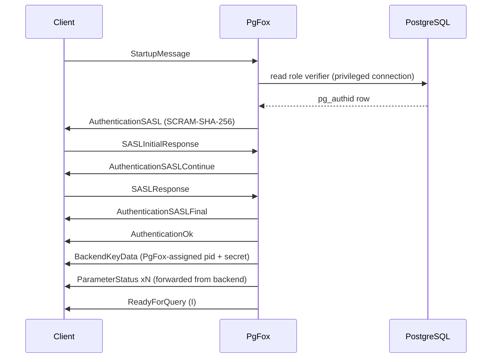

# Startup & wire protocol

This document describes the PostgreSQL protocol flows PgFox implements at
connection time: the startup handshake, authentication, and out-of-band query
cancellation. It reflects what PgFox actually does, which differs in important
ways from a naive proxy.

## Startup handshake

A client connects to PgFox and speaks the PostgreSQL frontend/backend protocol
(version 3.0). The exchange looks like this:

### Reading the startup message

The startup message begins with a 4-byte length, then a 4-byte protocol version
(`196608`, i.e. 3.0), followed by null-terminated key/value parameter pairs.
PgFox parses these into a map; `user` and `database` are required. The `user`
and `database` determine which target and pool the client's queries route to.

### Authentication (SCRAM-SHA-256)

PgFox authenticates the client itself rather than forwarding credentials. It
requests SCRAM-SHA-256, and to verify the client it needs the role's stored
verifier:

- Over its privileged connection (authenticated as `pgfox_role`), PgFox reads
  the role's SCRAM verifier from `pg_authid.rolpassword`.
- It runs the SCRAM exchange (`AuthenticationSASL` → `SASLInitialResponse` →
  `AuthenticationSASLContinue` → `SASLResponse` → `AuthenticationSASLFinal`)
  against that verifier.
- On success it sends `AuthenticationOk`.

This is genuine authentication: a client that does not know the role's password
cannot complete the exchange. PgFox never stores plaintext passwords.

When PgFox later opens the backend connection for this session, it authenticates
to PostgreSQL with the role's TLS client certificate (generating it if needed),
so the backend session runs as the client's real role.

### BackendKeyData

PgFox sends the client a `BackendKeyData` message containing a process id and
secret key. These are **PgFox-assigned, unique per client** — not a backend's
values and not dummy constants. They exist so an out-of-band cancel request can
be mapped back to this specific client (see Cancellation below).

### ParameterStatus

The `ParameterStatus` messages a client receives reflect the **real backend
server's** parameters (`server_version`, `client_encoding`, `DateStyle`,
`TimeZone`, and so on), forwarded from the backend's own startup response, so the
client sees accurate server settings rather than a value invented by the proxy.

### ReadyForQuery

Finally PgFox sends `ReadyForQuery` with status `I` (idle), signalling the client
may begin sending queries. The client is now authenticated and subsequent
messages are handled as queries and commands.

## Query lifecycle

After startup, a client sends queries using either the simple query protocol
(`Query`) or the extended protocol (`Parse`/`Bind`/`Describe`/`Execute`/`Sync`).
PgFox routes each to a backend, rewriting prepared-statement names for sharing
where possible, and forwards responses back. Transaction status reported on each
`ReadyForQuery` drives backend pinning. See
[Architecture](architecture.md#connection-pooling-a-single-hybrid-model) for the
routing and pinning rules, and [Usage scenarios](usage.md) for the
client-visible behavior.

## Cancellation (out of band)

To cancel a running query, a PostgreSQL client opens a **new** connection and
sends a `CancelRequest` — a special packet (magic code `80877102`) carrying the
`(process id, secret)` it received in `BackendKeyData`. It carries no other
session context.

PgFox resolves it as follows:

1. Look up the client by the `process id` from its registry of assigned cancel
   keys.
2. Verify the `secret` matches what PgFox issued that client.
3. Find the backend currently running that client's in-flight query.
4. Open a short-lived connection to that backend's PostgreSQL target and send a
   `CancelRequest` carrying the **backend's** real `(process id, secret)` —
   which PgFox captured from the backend's own `BackendKeyData` when the backend
   connected.

If the client has no query in flight, or the key does not match, the request is
ignored. Because cancellation is asynchronous, a query may complete in the brief
window before the cancel is delivered; PostgreSQL treats a cancel for a
no-longer-running query as a no-op.

## Debugging tips

- Run with debug logging (`logging.level: debug`) to see message-level tracing.
- Verify clients negotiate protocol version `196608` (`0x00030000`).
- Test connectivity with `psql`:
  `psql -h localhost -p 5433 -U <role> -d <db>`.
- To exercise cancellation, start a long query (for example
  `SELECT pg_sleep(30);`) and interrupt it (Ctrl-C in `psql`); the backend query
  should be cancelled.
